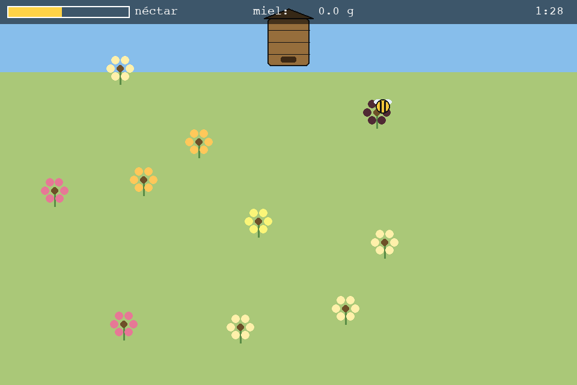

# 🐝 Abejas de la Pampa

> Juego 2D en **Python + Pygame** sobre el pecoreo de una abeja obrera en el
> **Caldenal** de La Pampa: volá de flor en flor, juntá néctar de especies
> nativas y llevalo a la colmena para producir miel.


<p align="center">
  
</p>

---

## Índice

- [Descripción](#descripción)
- [Estado actual (v0.1.0)](#estado-actual-v010)
- [Requisitos](#requisitos)
- [Instalación y ejecución](#instalación-y-ejecución)
- [Controles](#controles)
- [Cómo se juega](#cómo-se-juega)
- [Estructura del proyecto](#estructura-del-proyecto)
- [Contexto: por qué La Pampa](#contexto-por-qué-la-pampa)
- [Roadmap](#roadmap)
- [Créditos](#créditos)
- [Licencia](#licencia)

---

## Descripción

Controlás una **abeja pecoreadora**. El mapa es un recorte del **Monte
pampeano** con flores de **caldén, chañar, piquillín y jarilla**. Cada especie
da distinta cantidad de néctar y se recarga a distinto ritmo. Juntás néctar
hasta llenar el buche y volvés a la **colmena**, donde se transforma en miel.
La ronda dura 90 segundos: la meta es cosechar la mayor cantidad de miel.

Toda la información biológica y regional que sustenta el juego está en
[`docs/INFO-ABEJAS-LA-PAMPA.md`](docs/INFO-ABEJAS-LA-PAMPA.md).

## Estado actual (v0.1.0)

Primera versión jugable (MVP). Incluye:

- Movimiento libre de la abeja en 8 direcciones.
- 4 especies de flores nativas con néctar y recarga propios.
- Buche con capacidad limitada (hay que volver a descargar).
- Colmena que convierte néctar en miel.
- HUD con carga de néctar, miel acumulada y tiempo.
- Fin de ronda por tiempo y reinicio con `R`.

Lo que viene (predadores, día/noche, danza de la abeja, abejas nativas,
ranking) está en el [Roadmap](#roadmap) y en
[`docs/ROADMAP.md`](docs/ROADMAP.md).

## Requisitos

- Python 3.10 o superior
- [pygame-ce](https://pyga.me/) 2.5+

## Instalación y ejecución

```bash
git clone https://github.com/silvanagarcia/abejas-pampa.git
cd abejas-pampa

python -m venv .venv
source .venv/bin/activate        # Windows: .venv\Scripts\activate

pip install -r requirements.txt
python -m src.main
```

## Controles

| Tecla | Acción |
|---|---|
| ← ↑ → ↓  /  W A S D | Mover la abeja |
| `R` | Reiniciar la ronda |
| `ESC` | Salir |

## Cómo se juega

1. Salís de la zona de la colmena y buscás flores.
2. Te posás sobre una flor: el néctar pasa de la flor a tu buche.
3. Cuando el buche está lleno (`¡LLENA!`), volvés a tocar la **colmena**.
4. El néctar descargado se convierte en miel (factor 0,7).
5. Las flores se recargan solas: conviene rotar entre varias.
6. A los 90 segundos termina la jornada y ves tu cosecha total.

## Estructura del proyecto

```
abejas-pampa/
├── src/
│   ├── main.py                 # bucle principal y manejo de eventos
│   ├── constants/
│   │   └── config.py           # todo el balance y los colores
│   ├── entities/
│   │   ├── abeja.py            # la jugadora
│   │   ├── flor.py             # flores nativas + generación del campo
│   │   └── colmena.py          # descarga de néctar → miel
│   ├── scenes/
│   │   └── game_scene.py       # una ronda completa
│   ├── UI/
│   │   └── hud.py              # HUD y cartel final
│   └── service/                # (reservado: audio, persistencia)
├── docs/
│   ├── INFO-ABEJAS-LA-PAMPA.md # investigación de respaldo
│   ├── documento-diseno.md     # diseño del juego
│   ├── ARQUITECTURA.md         # cómo está armado el código
│   ├── ROADMAP.md              # fases de complejidad
│   └── CREDITOS.md
├── build/                      # scripts de empaquetado (a futuro)
├── requirements.txt
├── CHANGELOG.md
└── LICENSE
```

## Contexto: por qué La Pampa

La Pampa produce ~7.000 t de miel al año (~11 % del total nacional), con la
floración del **Caldenal** como sustento principal y una apicultura
**trashumante**. El juego usa ese marco real. Detalle y fuentes en
[`docs/INFO-ABEJAS-LA-PAMPA.md`](docs/INFO-ABEJAS-LA-PAMPA.md).

## Roadmap

| Fase | Contenido |
|---|---|
| **0.1** ✅ | MVP: mover, pecorear, descargar, HUD, ronda por tiempo |
| 0.2 | Menú, pantalla de inicio, sonido, sprites mejores |
| 0.3 | Energía/vida de la abeja, viento, día y noche |
| 0.4 | Predadores (aves, avispas), agroquímicos como peligro |
| 0.5 | Danza de la abeja: abejas ayudantes tras una buena carga |
| 0.6 | Modo abeja nativa sin aguijón + puntaje de biodiversidad |
| 0.7 | Temporadas / trashumancia: mover el apiario entre Monte y pradera |
| 0.8 | Ranking persistente en SQLite |

## Créditos

**Dirección y desarrollo:** Silvana Garcia.
Detalle en [`docs/CREDITOS.md`](docs/CREDITOS.md).

## Licencia

[MIT](LICENSE) — © 2026 Silvana Garcia.
