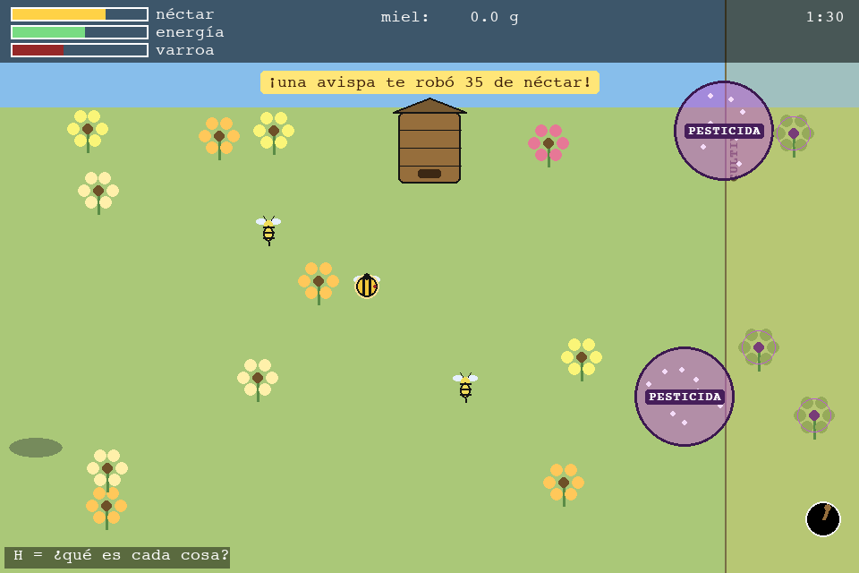
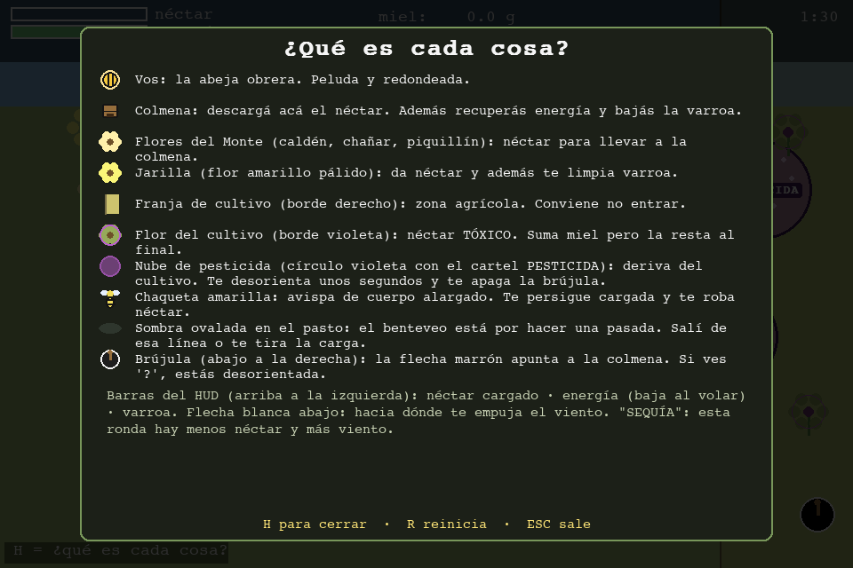

# Guía visual — qué es cada cosa en pantalla

Dentro del juego, la tecla **`H`** abre esta misma leyenda (y pausa la ronda).

## El escenario

| En pantalla | Qué es |
|---|---|
| **Franja verde clara** (casi todo el mapa) | El **Monte pampeano / Caldenal**. Acá pecoreás. |
| **Banda celeste de arriba** | Cielo / horizonte. La colmena se apoya sobre el borde. |
| **Franja amarillenta del borde derecho**, con el cartel vertical `CULTIVO` | **Zona agrícola**. Conviene **no entrar**: hay deriva de pesticida y flores tóxicas. |
| **Línea marrón vertical** | Límite entre el Monte y el cultivo. |

## Objetos que te ayudan

| Ícono | Qué es | Detalle |
|---|---|---|
| Círculo **amarillo con rayas negras y pelusa**, con cabecita negra | **Vos**, la abeja obrera | Es *redonda y peluda* (así se distingue de la avispa). |
| **Caja de madera con techo** (arriba al centro) | **Colmena** | Tocala para **descargar néctar** → miel. También **recuperás energía** y **bajás la varroa**. |
| **Flor de pétalos claros / amarillos / rosados** con centro marrón | **Flores nativas**: caldén, chañar, piquillín | Te dan **néctar**. Se recargan solas: conviene rotar. |
| **Flor amarillo pálido** | **Jarilla** | Da néctar y, mientras estás posada, **te limpia varroa** (resina/propóleos). |

## Peligros

| Ícono | Qué es | Qué te hace | Cómo lo manejás |
|---|---|---|---|
| Círculo **violeta con motas** y el cartel **`PESTICIDA`**, que se mueve | **Nube de deriva de agroquímico** | Efecto **subletal**: te **desorienta** unos segundos (los controles se tuercen) y **se apaga la brújula** a la colmena (ves `?`) | No te acerques a la franja de cultivo; si te agarra, esperá a que pase |
| **Flor con borde violeta** (dentro del cultivo) | **Flor contaminada** | Su néctar **suma miel pero la resta al final** (penalización por néctar tóxico) | Pecoreá en el Monte, no en el cultivo |
| Insecto de **cuerpo alargado a rayas**, con cintura y aguijón | **Chaqueta amarilla** (*Vespula germanica*), avispa invasora | Te **persigue cuando vas cargada** y te **roba néctar** por contacto | Descargá rápido; evitala cuando llevás el buche lleno. Salen sobre todo en el último tramo de la ronda ("otoño") |
| **Óvalo gris sobre el pasto** (sin pájaro visible todavía) | **Sombra del benteveo**: avisa ~1 s antes de la pasada | Si la pasada te engancha, **soltás toda la carga** | Salí de esa línea horizontal antes de que llegue |
| Barra **roja** en el HUD / puntitos rojos sobre la abeja | **Varroa** (ácaro) | Cuanto más alta, **más lenta** y **menos capacidad** de buche | Volvé a la colmena o posate en **jarilla** |
| Barra **verde** del HUD en rojo / cartel `¡SIN ENERGÍA!` | **Energía agotada** | Tenés **6 segundos** para llegar a la colmena o **termina la jornada** | Volvé seguido a la colmena a "comer" |
| Flechita blanca abajo (`viento`) / cartel `SEQUÍA` | **Viento** que te empuja / ronda **más seca** | El viento desvía tu vuelo; con sequía hay **menos néctar** y **más viento** | Corregí el rumbo; priorizá flores llenas |

## El HUD

- **Arriba a la izquierda:**
  - barra **néctar**: cuánto llevás en el buche (cuando dice `¡LLENA!`, volvé a la colmena);
  - barra **energía**: baja mientras volás, se repone en la colmena;
  - barra **varroa**: aparece cuando empezás a acumular ácaros.
- **Arriba al centro:** miel acumulada en la colmena.
- **Arriba a la derecha:** tiempo restante de la ronda y, si corresponde, `SEQUÍA`.
- **Abajo a la derecha:** **brújula**. La flecha marrón apunta a la colmena; si ves `?`, estás desorientada por el pesticida.
- **Abajo a la izquierda:** recordatorio `H = ¿qué es cada cosa?`.
- **Banda central:** avisos efímeros (te robaron néctar, soltaste la carga, etc.).

## Pantalla final

Al terminar la jornada se muestra: el motivo, la **miel cosechada** bruta, el
**descuento por néctar contaminado** (si lo hubo) y la **cosecha neta** en grande.
`R` para jugar otra vez.

---

El porqué de cada peligro (con fuentes) está en
[`AMENAZAS-Y-MECANICAS.md`](AMENAZAS-Y-MECANICAS.md).
